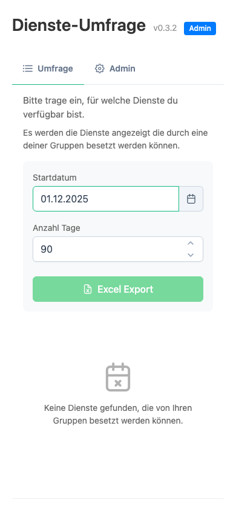
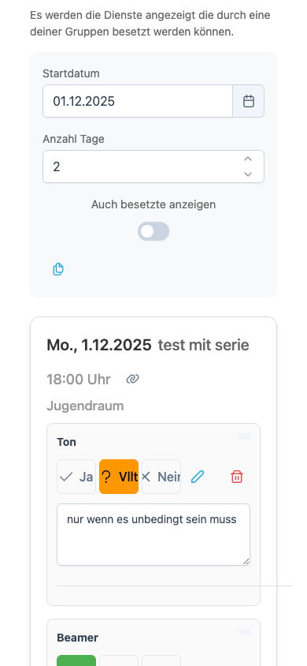
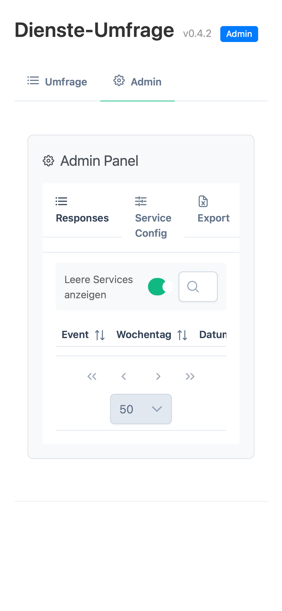
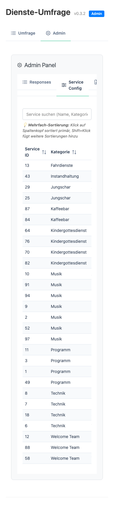
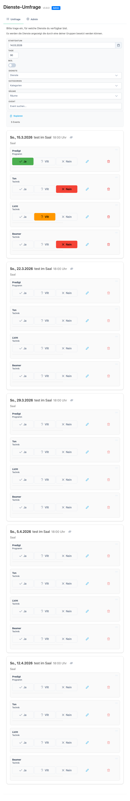
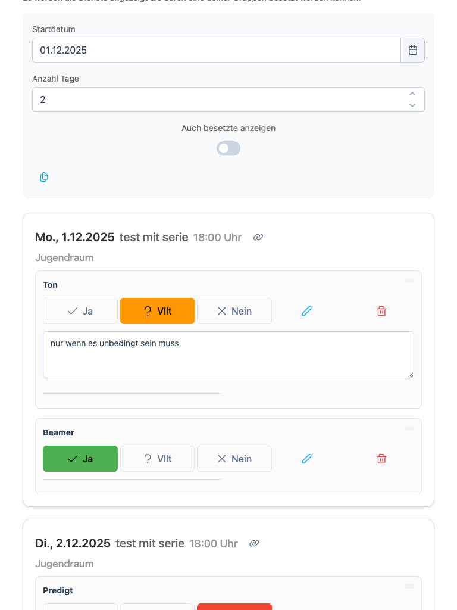
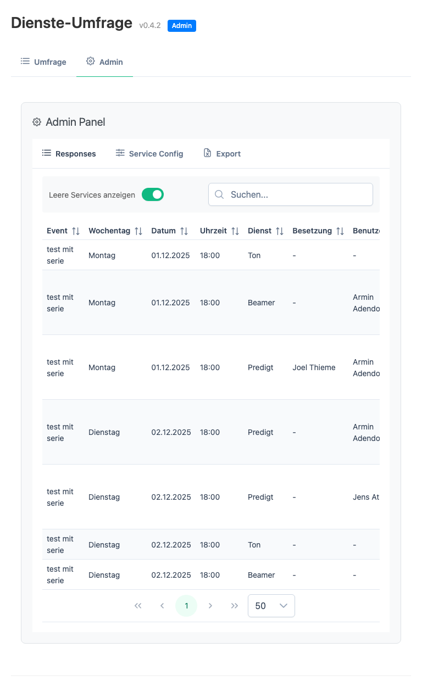
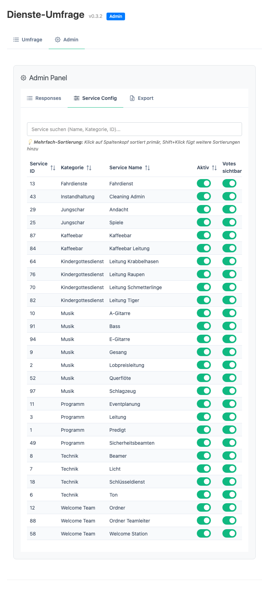

# Dienst-Umfrage Extension für ChurchTools

Eine ChurchTools-Erweiterung, die Mitarbeitern ermöglicht, ihre Verfügbarkeit für Dienste in anstehenden Events anzugeben. Planer können alle Antworten einsehen und beliebig exportieren.

**📚 Dokumentation**: 
- Benutzerhandbuch: [docs/USERMANUAL.md](docs/USERMANUAL.md)
- **Dokumentations-Index**: [docs/INDEX.md](docs/INDEX.md) ⭐ START HERE für Entwickler
- Filter-Implementierung: [docs/FILTER-IMPLEMENTATION.md](docs/FILTER-IMPLEMENTATION.md)

---

## 📋 Funktionen (Übersicht)

### Für Mitarbeiter
- 📅 **Event-Übersicht**: Zeigt nur Events mit Diensten, für die der Benutzer zuständig ist
- ❓ **Verfügbarkeitsabfrage**: Ja/Vielleicht/Nein für jeden Dienst
- 💬 **Kommentare**: Optionale Anmerkungen zu jeder Verfügbarkeit
- 👥 **Peer-Antworten**: Sehe wer "Ja", "Vielleicht" oder "Nein" gesagt hat
- 📱 **Responsive UI**: Optimiert für Mobile und Desktop

### Für Planer/Disponenten
- 📊 **Admin-Panel**: Separate Admin-UI mit 3 Tabs:
  - **Responses**: Tabellarische Übersicht aller Antworten mit Sortierung, Filterung, Bearbeitung
  - **Service Config**: Konfiguriere Sichtbarkeit von Votes pro Service
  - **Export**: Excel-Export aller Responses für externe Auswertung
- ✏️ **Response-Management**: Einzelne Antworten bearbeiten (Antwort, Kommentar ändern)
- 🗑️ **Response-Löschen**: Einzelne Antworten entfernen (z.B. bei Stornierung)
- 📋 **Audit-Trail**: Vollständige Nachverfolgung (Wer hat wann geändert)
- 📈 **Statistiken**: Anzahl Antworten und Events auf einen Blick

### Datenverwaltung
- 🔐 **Sicher**: Speicherung im ChurchTools Key-Value-Store
- 🔑 **Felder**: `eventId`, `serviceId`, `userId`, `userName`, `response`, `comment`, `timestamp`, `editedBy`, `editedAt`
- 📋 **Kategorien**: `poll-responses` für Umfrageantworten, `admin-config` für Konfiguration
- 🔄 **Änderungen**: Automatisches Speichern nach 1 Sekunde (Kommentare), explizit durch Buttons
- 📝 **Audit-Trail**: `timestamp` (ursprüngliche Eingabe), `editedAt`+`editedBy` (letzte Änderung mit Wer-Info)

---

## 🚀 Quick Start (Entwickler)

### Voraussetzungen
- Node.js v18+
- npm
- ChurchTools-Instanz mit API-Zugriff
- CORS konfiguriert (für Development)

### Installation

```bash
# Repository klonen
git clone https://github.com/bwl21/bwl-poll-event-services.git
cd bwl-poll-event-services

# Dependencies installieren
npm install

# .env erstellen
cp .env-example .env
# Dann .env editieren mit deiner ChurchTools-URL
```

### Development

```bash
# Development Server starten (Hot-Reload)
npm run dev
```

Öffne `http://localhost:5173` (oder HTTPS für Safari).

> **Safari-Tipp**: HTTP läuft nicht zuverlässig lokal. Nutze Vite-Proxy oder HTTPS (mkcert).

### Build & Deployment

```bash
# Produktiv-Build erstellen
npm run build

# Production-Build preview
npm run preview

# Build + Package für ChurchTools (in releases/)
npm run deploy
```

---

## 🧪 Testing

```bash
# E2E-Tests mit Playwright
npm run test:e2e

# Tests im UI-Modus
npm run test:e2e:ui

# Tests mit Browser-Ansicht
npm run test:e2e:headed

# Debug-Modus
npm run test:e2e:debug
```

Tests befinden sich in `tests/` und `test-results/`.

---

## 📂 Projekt-Struktur

```
src/
├── App.vue                    # Haupt-App mit Tab-Navigation (Umfrage/Admin)
├── main.ts                    # Einstiegspunkt (Vue 3 + PrimeVue Init)
├── types.ts                   # TypeScript-Typdefinitionen
├── pollService.ts             # Business-Logik (Events, Storage, Filterung)
├── exportService.ts           # Excel-Export (xlsx-Bibliothek)
├── components/
│   ├── EventCard.vue          # Event-Anzeige mit seinen Services
│   ├── ServiceRow.vue         # Dienst-Zeile mit Antwort-Buttons
│   ├── AdminPanel.vue         # Admin-Tab mit verschachtelter Navigation
│   ├── AdminResponses.vue     # Responses-Tabelle (Admin)
│   └── AdminConfig.vue        # Service-Konfiguration (Admin)
├── utils/
│   ├── kv-store.ts           # Wrapper für ChurchTools Key-Value-Store
│   └── ct-types.d.ts         # ChurchTools API Type-Definitionen
├── vite-env.d.ts             # Vite Environment Types
scripts/
├── package.js                 # Packaging-Script für ChurchTools-Deployment
docs/
├── Requirements.md            # Technische Anforderungen & Architektur
├── USERMANUAL.md             # Benutzerhandbuch (Admin/Mitarbeiter/Planer)
tests/
├── e2e/                       # Playwright E2E-Tests
```

---

## 🛠️ Konfiguration

### Environment-Variablen (.env)

```bash
# Erforderlich
VITE_KEY=bwl-poll-event-services              # Extension Key
VITE_BASE_URL=https://deine-instanz.church.tools

# Optional (nur für Entwicklung)
VITE_USERNAME=username
VITE_PASSWORD=password
```

### ChurchTools Admin-Setup

1. **Extension hochladen**: Gehe zu System Settings → Integrations → Custom Modules
2. **Extension aktivieren**: Upload der ZIP-Datei aus `releases/`
3. **Berechtigungen**: Admin-Berechtigung für `bwl-poll-event-services` → `admin-config` (Read)

---

## 🔌 ChurchTools API-Integration

Die Extension nutzt folgende Endpunkte:

### Events & Services
- `GET /events?from={date}&to={date}&include=eventServices` - Events mit Diensten
- `GET /event/masterdata` - Service-Definitionen und Kategorien

### Benutzer
- `GET /whoami` - Aktueller Benutzer
- `GET /persons/{personId}/groups` - Gruppenzugehörigkeiten

### Ressourcen (Optional)
- `GET /calendars/appointments?calendar_ids[]={id}&from={date}&to={date}&include[]=bookings` - Gebuchte Ressourcen

### Key-Value Store
- `GET /custommodules/{moduleId}/customdatacategories/{categoryId}/customdatavalues`
- `POST /custommodules/{moduleId}/customdatacategories/{categoryId}/customdatavalues`
- `PUT /custommodules/{moduleId}/customdatacategories/{categoryId}/customdatavalues/{valueId}`
- `DELETE /custommodules/{moduleId}/customdatacategories/{categoryId}/customdatavalues/{valueId}`

---

## 📚 Stack & Dependencies

| Package | Version | Zweck |
|---------|---------|-------|
| **Vue** | ^3.5.27 | UI-Framework |
| **PrimeVue** | ^4.5.4 | UI-Komponenten-Bibliothek |
| **Vite** | ^7.3.1 | Build-Tool & Dev-Server |
| **TypeScript** | ^5.9.2 | Type-Safety |
| **XLSX** | ^0.18.5 | Excel-Export |
| **ChurchTools Client** | ^1.4.0 | API-Integration |
| **Playwright** | ^1.58.0 | E2E-Testing |

---

## 🔄 Ablauf: Event-Abruf und Filterung

```
1. Benutzer öffnet Extension
   ↓
2. App.vue lädt Events (pollService.getRelevantEvents)
   ├─ GET /whoami → Aktueller Benutzer
   ├─ GET /persons/{id}/groups → Gruppenzugehörigkeiten
   ├─ GET /events?from=X&to=Y&include=eventServices → Alle Events im Zeitraum
   └─ GET /event/masterdata → Service-Definitionen
   ↓
3. Filterung (pollService.filterServicesByUserGroups)
   ├─ Für jeden Event-Service: Suche Service-Definition in Masterdata
   ├─ Prüfe: Hat Service Gruppen-Restriktionen?
   ├─ Falls ja: Service nur zeigen wenn Benutzer in einer Gruppe ist
   └─ Nur Events mit ≥1 relevanten Service anzeigen
   ↓
4. EventCard + ServiceRow rendern
   ├─ Pro Event: EventCard.vue
   ├─ Pro Service: ServiceRow.vue mit:
   │  ├─ Antwort-Buttons (Ja/Vielleicht/Nein)
   │  ├─ Kommentarfeld (Auto-Save nach 1s)
   │  └─ Peer-Antworten anzeigen
   └─ Bestätigte Besetzungen zeigen
   ↓
5. Speicherung
   ├─ Kommentare: Auto-Save nach 1 Sekunde (Debounce)
   ├─ Antworten: Explicit Save bei Button-Click
   └─ In KV-Store Kategorie: poll-responses
```

---

## 📅 Datennutzung im Dienstplaner-System

Die gesammelten Verfügbarkeitsdaten können direkt in Dienstplaner-Systemen verwendet werden.

### Export der Daten

**Excel-Export aus Admin-Panel:**
```bash
Admin Tab → Export → "Export als Excel"
```

Exportierte Datei enthält:
- Event (Name, Datum, Uhrzeit)
- Dienst (Name, Kategorie)
- Benutzer (Name)
- Antwort (Ja / Vielleicht / Nein / NULL)
- Kommentar (falls vorhanden)
- Eingabe-Zeitstempel (ISO 8601, ursprüngliche Erfassung)
- Bearbeitet von (Admin-Name oder Mitarbeiter-Name, falls geändert)
- Bearbeitungs-Zeitstempel (ISO 8601, letzte Änderung)

**Beispiel Export:**

| Event | Dienst | Benutzer | Antwort | Kommentar | Eingabe-Zeit | Bearbeitet von | Bearbeitungs-Zeit |
|-------|--------|----------|---------|-----------|-------------|----------------|------------------|
| GD 2.2.2025 | Lobpreis-Leitung | Anna | Ja | Bis 12h | 2025-01-31T15:30:00Z | Anna | 2025-01-31T15:30:00Z |
| GD 2.2.2025 | Lobpreis-Leitung | Peter | Nein | | 2025-02-01T10:00:00Z | Admin (Planer1) | 2025-02-01T14:15:00Z |
| GD 2.2.2025 | Keyboard | Lisa | Vielleicht | Falls Auto läuft | 2025-01-31T14:22:00Z | Lisa | 2025-01-31T14:22:00Z |

### Integration mit Dienstplanung

#### Szenarien

**1. Manuelle Disposition im Planer**
- Admin exportiert Responses
- Öffnet Excel-Datei oder Dienstplaner-Software
- Filtert/Sortiert nach Event und Dienst
- Sieht sofort alle Zusagen und Absagen
- Plant Dienste basierend auf Verfügbarkeit ein

**2. Automatische Disposition (API-Integration)**
Dienstplaner-Systeme können die Daten direkt aus ChurchTools abrufen:

```typescript
// Pseudo-Code: Responses abrufen via ChurchTools API
GET /custommodules/{moduleId}/customdatacategories/poll-responses/customdatavalues

Response:
{
  "eventId": 123,
  "serviceId": 456,
  "userId": 789,
  "response": "yes",         // "yes" | "maybe" | "no"
  "comment": "Bis 12h",
  "timestamp": "2025-01-31T15:30:00Z"
}
```

Ein Dienstplaner kann dann:
- Automatisch Mitarbeiter zuweisen (basierend auf "Ja"-Antworten)
- Wartelisten pflegen (basierend auf "Vielleicht")
- Lücken identifizieren (basierend auf "Nein")

**3. Hybrid-Ansatz**
```
Dienst-Umfrage Extension
    ↓
Daten im KV-Store + Excel-Export
    ↓
Dienstplaner-Software (z.B. ChurchTools Dienste, eigenes System)
    ↓
Automatische/manuelle Zuweisungen
    ↓
Rückmeldung an Mitarbeiter (via Mail/SMS/Push)
```

#### Daten-Mapping

Für die Verwendung in externen Systemen:

```typescript
// Eingehende Umfrage-Daten
interface PollResponse {
  eventId: number;           // → Dienstplan Event-ID
  serviceId: number;         // → Dienstplan Service-ID
  userId: number;            // → Dienstplan Person-ID
  userName: string;          // → Mitarbeiter-Name (Lesbarkeit)
  response: 'yes' | 'maybe' | 'no' | null;  // → Verfügbarkeit
  comment: string;           // → Notizen für Planer
  timestamp: string;         // → Ursprüngliche Erfassungs-Zeit (ISO 8601)
  editedBy: string;          // → Wer hat zuletzt geändert (Audit)
  editedAt: string;          // → Wann wurde zuletzt geändert (ISO 8601)
}

// Mapping zu Dienstplan-Zuweisungen
interface ServiceAssignment {
  eventId: number;
  serviceId: number;
  personId: number;
  status: 'confirmed' | 'tentative' | 'available' | 'unavailable';
  notes: string;
}

// Mapping-Logik
const mapToAssignment = (poll: PollResponse): ServiceAssignment => {
  return {
    eventId: poll.eventId,
    serviceId: poll.serviceId,
    personId: poll.userId,
    status: poll.response === 'yes' ? 'available' 
            : poll.response === 'maybe' ? 'tentative'
            : 'unavailable',
    notes: poll.comment
  };
};
```

### Best Practices für Dienstplanung

#### 1. Timing
```
Woche 1: Event-Umfrage startet
Woche 2: Mitarbeiter füllen Umfrage aus
Woche 3: Planer exportiert und erstellt Dienste-Plan
Woche 4: Rückmeldung an Mitarbeiter
```

#### 2. Häufig gestellte Fragen handhaben

**"Ich bin im System als 'Vielleicht' eingetragen, aber bin doch sicher verfügbar"**
- Mitarbeiter kann Antwort jederzeit ändern
- Planer sieht Timestamp und kann älteste Antworten bevorzugen

**"Ich bin eingeplant worden, muss aber doch absagen"**
- Im Dienstplaner absagen
- Optional: In Umfrage nachträglich auf "Nein" setzen
- Planer erhält Benachrichtigung und kann neu disponieren

**"Mehrere Mitarbeiter gleich qualifiziert - wen nehme ich?"**
- Kommentare berücksichtigen ("Bevorzugt am Samstag")
- Ausgleich: Wer war zuletzt eingeplant?
- Anfänger bevorzugen (für Training)

#### 3. Fallbacks

```
Dienst: Lobpreis-Leitung (Event: 2.2.2025)

Erste Wahl: Anna (Ja, erfahren)
Zweite Wahl: Peter (Ja, neu)
Dritt Wahl: Lisa (Vielleicht, mit Bedingungen)
Fallback: Admin selbst eingeplant + Nachricht an "Nein"-Sager
```

#### 4. Export-Häufigkeit
- **Während Abfrage-Phase**: 1x täglich exportieren (um Trends zu sehen)
- **Nach Abfrage-Deadline**: Final-Export für Disposition
- **Nach Disposition**: Archive für Nachverfolgung

### Integration mit anderen Systemen

#### Beispiel: Dienst-Verwaltung in ChurchTools
```
ChurchTools Dienste Module
    ↓
    ├─ Lädt Responses aus poll-event-services
    ├─ Zeigt Verfügbarkeiten an
    └─ Ermöglicht 1-Klick-Zuweisungen basierend auf Umfrage
```

#### Beispiel: Externes Dienstplaner-Tool
```
Externes System (z.B. Google Sheets, Airtable, eigene App)
    ↓
    ├─ Importiert Excel aus poll-event-services
    ├─ Oder: API-Zugriff auf KV-Store direkt
    ├─ Wendet Logik an (Algorithmus, Regeln)
    └─ Erstellt Dienste-Plan
```

#### Beispiel: Benachrichtigungs-System
```
poll-event-services (Daten sammeln)
    ↓
Excel-Export oder API-Read
    ↓
Benachrichtigungs-System (z.B. Mail, SMS, Push)
    ↓
"Liebe Anna, du bist für Lobpreis-Leitung am 2.2. eingeplant!"
```

### Daten-Backup und Archiv

```bash
# Monatliches Backup erstellen
cd /Admin Panel → Export
# Speichern als: responses_2025-02_BACKUP.xlsx

# Historische Daten archivieren
# → Separate Ordner pro Monat/Quartal
# → Für längerfristige Analysen
```

---

## 🔐 Sicherheit & Berechtigungen

- **Authentifizierung**: Über ChurchTools-Login
- **Autorisierung**: Basierend auf Gruppenzugehörigkeit
- **XSS-Schutz**: HTML-Escaping aller Benutzereingaben
- **Admin-Zugriff**: Prüfung der Leseberechtigung auf `admin-config` KV-Store Kategorie

---

## 📸 Screenshots & Dokumentation

### Screenshots für USERMANUAL.md erstellen

**Automatisch Screenshots generieren** für Mobile, Desktop und Tablet Views:

#### Voraussetzungen
- Development Server läuft: `npm run dev`
- Playwright ist installiert

#### Screenshots generieren

**Du brauchst 2 Terminals:**

Terminal 1 (Dev-Server):
```bash
npm run dev
```

Terminal 2 (Screenshots):
```bash
npm run screenshots
```

**Oder mit UI-Mode für bessere Kontrolle (Terminal 2):**
```bash
npm run test:e2e:ui -- screenshots.spec.ts
```

> **Tipp:** Der Dev-Server muss auf `http://localhost:5173` laufen, damit Playwright die App testen kann.

#### Generierte Dateien
Screenshots werden automatisch in `docs/screenshots/` gespeichert:

**Desktop (Chrome)**
-  - Desktop Übersicht
-  - Desktop Tabellen-Layout
-  - Admin: Responses
-  - Admin: Service-Konfiguration
-  - Admin: Excel-Export

**Mobile (Chrome)**
-  - Mobile Übersicht
-  - Mobile Tabellen-Layout
-  - Mobile: Admin Responses
-  - Mobile: Admin Service-Config

**Tablet (Chrome)**
-  - Tablet Übersicht
-  - Tablet Tabellen-Layout
-  - Tablet: Admin Responses
-  - Tablet: Admin Service-Config

#### In USERMANUAL.md einfügen

```markdown
#### 📱 Mobile Darstellung


Die Extension passt sich automatisch an kleine Bildschirme an.

#### 🖥️ Desktop Darstellung


Auf Desktops wird eine tabellarische Ansicht verwendet.
```

#### Viewport-Größen
```
Mobil:   390 x 844 (iPhone 12)
Tablet:  768 x 1024 (iPad)
Desktop: 1920 x 1080 (Full HD)
```

#### Screenshot-Test anpassen

Neue Screenshots hinzufügen in `tests/screenshots.spec.ts`:

```typescript
test('12-Desktop: Neue Funktion', async ({ page }) => {
  await page.setViewportSize({ width: 1920, height: 1080 });
  await page.goto('/', { waitUntil: 'domcontentloaded' });
  await page.waitForTimeout(500);
  
  // Navigate if needed
  await page.click('[data-testid="feature"]');
  
  // Capture
  await page.screenshot({
    path: 'docs/screenshots/12-desktop-new-feature.png',
    fullPage: true
  });
});
```

#### Best Practices
- ✅ **Konsistente Test-Daten**: Verwende die gleichen Daten für alle Screenshots
- ✅ **Aussagekräftig**: Screenshot sollte die Funktion deutlich zeigen
- ✅ **Vollständig**: Nutze `fullPage: true` wenn nötig
- ✅ **Beschriftet**: Alt-Text in Markdown hinzufügen
- ❌ **Keine sensiblen Daten**: Keine echten E-Mails/Nummern
- ❌ **Keine leeren Felder**: Nicht aussagekräftig

#### Weitere Dokumentation
- Detaillierter Guide: [SCREENSHOT-GUIDE.md](SCREENSHOT-GUIDE.md)
- Markdown-Templates: [docs/USERMANUAL-SCREENSHOTS-TEMPLATE.md](docs/USERMANUAL-SCREENSHOTS-TEMPLATE.md)

---

## 🐛 Häufige Entwickler-Probleme

### CORS-Fehler in Development
**Problem**: "CORS policy blocked"

**Lösung**:
1. In ChurchTools Admin: System Settings → API → CORS
2. Localhost:5173 (oder Ihre Dev-URL) zulassen
3. Oder: Vite-Proxy in `vite.config.ts` konfigurieren

### Safari funktioniert nicht (aber Chrome schon)
**Problem**: Login/Cookies funktionieren nicht in Safari lokal

**Lösung**:
- HTTP funktioniert bei Safari nicht zuverlässig
- Optionen:
  1. **Vite-Proxy** nutzen (`/api → https://xyz.church.tools`)
  2. **HTTPS** lokal (mit [mkcert](https://github.com/FiloSottile/mkcert))

### Typescript-Fehler bei ChurchTools Types
**Problem**: Fehlende ChurchTools API-Typen

**Lösung**: `src/utils/ct-types.d.ts` enthält die wichtigsten Typen. Falls weitere nötig: Typen hinzufügen oder `any` nutzen (nicht ideal, aber pragmatisch).

---

## 📖 Weitere Dokumentation

- **[docs/Requirements.md](docs/Requirements.md)** - Technische Anforderungen, Architektur, API-Docs
- **[docs/USERMANUAL.md](docs/USERMANUAL.md)** - Benutzerhandbuch (Admin, Mitarbeiter, Planer)
- **[TEST-ROADMAP.md](TEST-ROADMAP.md)** - Test-Planung und -Strategie

---

## 🚢 Release & Versionierung

**Aktuelle Version**: 0.3.2 (siehe `package.json`)

### Release-Prozess
1. Version in `package.json` erhöhen
2. `npm run deploy` ausführen
3. Package aus `releases/` wird erstellt
4. ZIP-Datei in ChurchTools hochladen

### Changelog
- **0.3.2**: Excel-Export, Error-Handling, E2E-Tests
- **0.3.0**: Admin-Panel, Service-Config, UI-Improvements
- **0.2.0**: Basis-Features (Events, Umfrage, KV-Store)

---

## 🤝 Contribution & Support

### Bug-Reports
- GitHub Issues: [bwl21/bwl-poll-event-services/issues](https://github.com/bwl21/bwl-poll-event-services/issues)

### ChurchTools Support
- Forum: [forum.church.tools](https://forum.church.tools)
- Docs: [church.tools/help](https://www.church.tools/help)

---

## 📝 Lizenz

Siehe [LICENSE](LICENSE) (falls vorhanden)

---

**Repository**: https://github.com/bwl21/bwl-poll-event-services  
**Maintainer**: BWL  
**Last Updated**: Januar 2025
