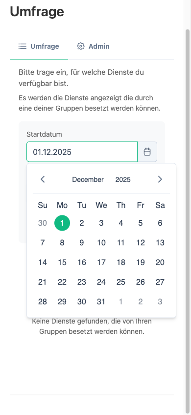
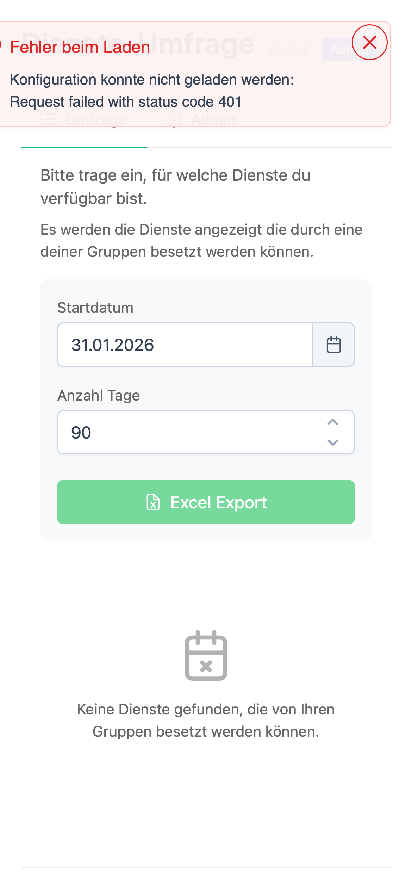
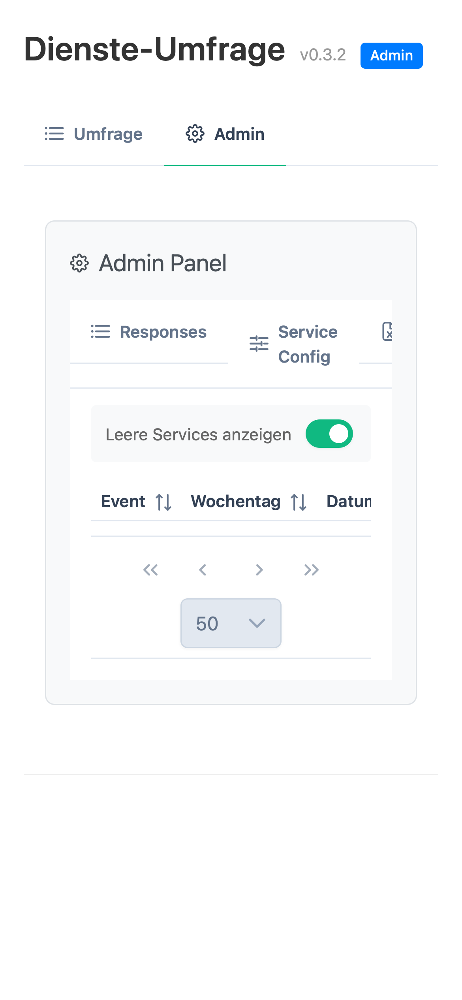
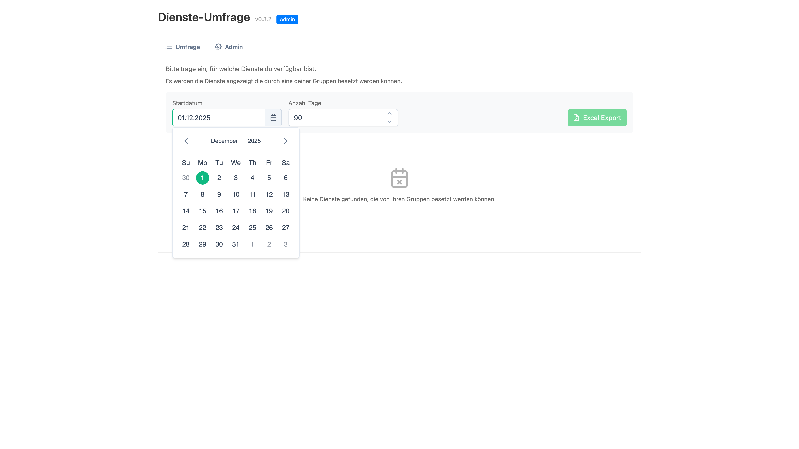
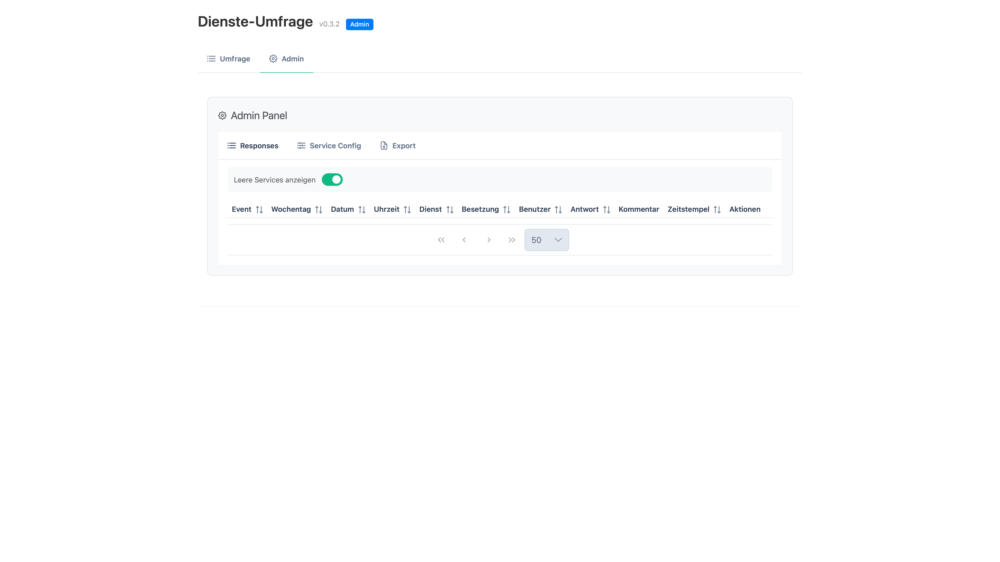
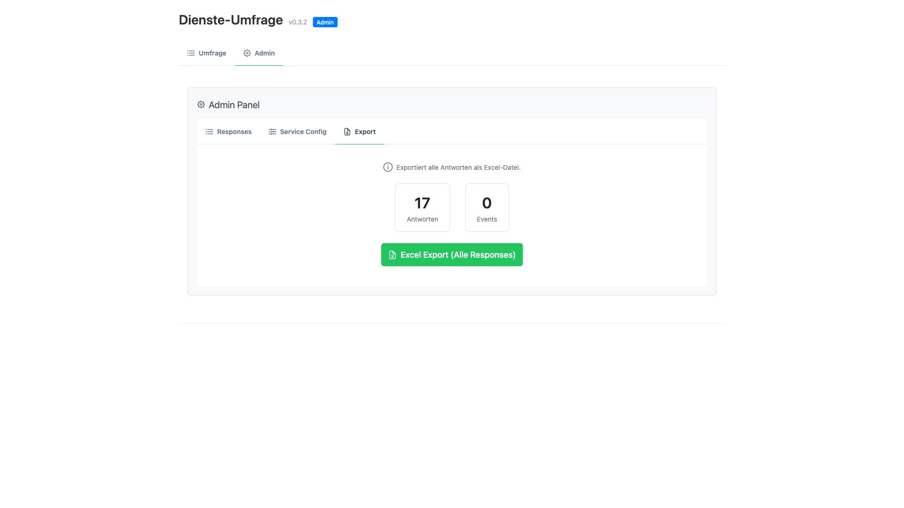
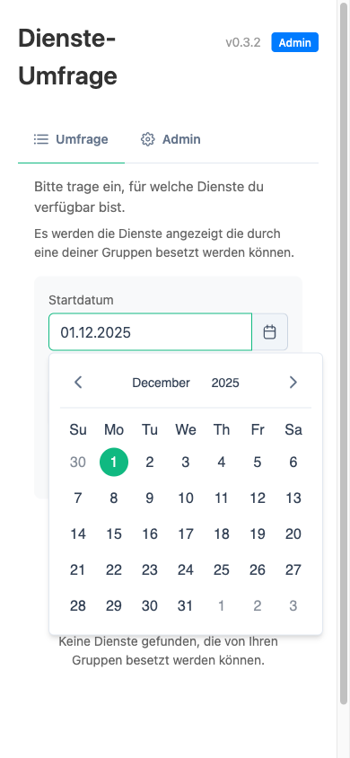
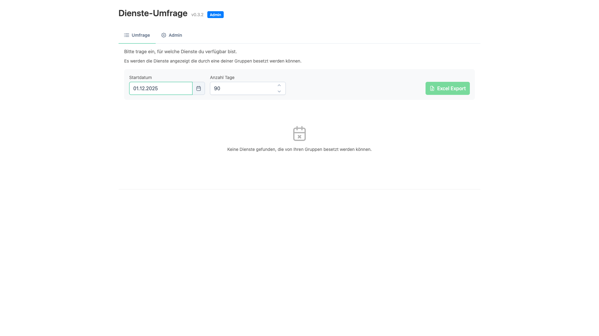
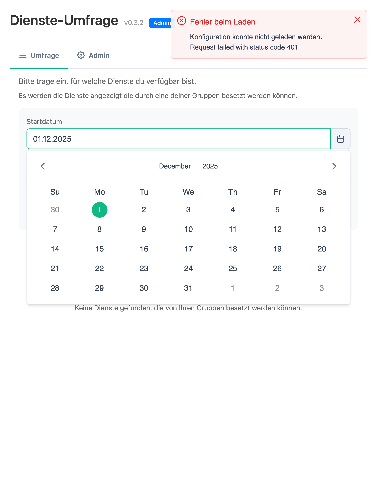

# Screenshots Template für USERMANUAL.md

Verwende diese Vorlagen, um Screenshots in die USERMANUAL.md einzufügen.

## 📱 Mobile Screenshots

### Umfrage-Übersicht (Mobile)
```markdown
### Mobil vs. Desktop

#### 📱 Mobile Darstellung


**Optimiert für Smartphones und Tablets:**
- Schlanke Darstellung übereinander
- Buttons nebeneinander (leicht zu tippen)
- Scrollbares Layout für kleine Bildschirme
- Angepasste Schriftgrößen
```

### Service-Row (Mobile)
```markdown
#### Beispiel: Service-Zeile auf Mobile



Jeder Dienst zeigt:
- Dienst-Name
- 3 Antwort-Buttons (Ja/Vielleicht/Nein) nebeneinander
- Kommentarfeld
- Antworten anderer (kompakt)
```

### Zeitraum-Einstellungen (Mobile)
```markdown
#### Zeitraum ändern



Oben auf der Seite können Sie:
- **Startdatum**: Mit Datepicker auswählen
- **Anzahl Tage**: Eingabefeld
- **OK-Button**: Zum Aktualisieren der Event-Liste
```

### Admin-Tab (Mobile)
```markdown
#### Admin-Bereich auf Mobile



Der Admin-Tab ist auch auf Mobile verfügbar:
- Verschachtelte Tab-Navigation
- Alle Funktionen erhalten bleiben
- Optimierte Touch-Größen für Buttons
```

---

## 🖥️ Desktop Screenshots

### Umfrage-Übersicht (Desktop)
```markdown
#### 🖥️ Desktop Darstellung


**Tabellarische Ansicht mit optimiertem Layout:**
- Alle Informationen auf einen Blick
- 4 Spalten: Dienst | Meine Antwort | Besetzung | Andere Antworten
- Breiter für umfangreichere Informationen
- Sortierbar und filterbar
```

### Tabellarische Service-Ansicht (Desktop)
```markdown
#### Tabellen-Layout Desktop



Die tabellarische Darstellung zeigt pro Zeile:
1. **Dienst**: Service-Name
2. **Meine Antwort**: Antwort-Buttons + Kommentarfeld
3. **Besetzung**: Wer ist bereits gebucht?
4. **Andere Antworten**: Wer hat was gesagt? Mit Kommentaren
```

---

## 🛠️ Admin Panel Screenshots

### Admin: Responses Tab
```markdown
#### a) **Responses** - Alle Antworten verwalten



Im Responses-Tab haben Sie:
- Tabellarische Übersicht aller Umfrageantworten
- **Spalten**: Event | Dienst | Benutzer | Antwort | Kommentar | Eingabe-Zeit | Bearbeitet von | Bearbeitungs-Zeit
- **Funktionen**:
  - Sortieren (Klick auf Spalten-Header)
  - Filtern (nach Event/Dienst/Benutzer)
  - **Bearbeiten** (Antwort oder Kommentar ändern)
  - **Löschen** (Antwort entfernen)
```

### Admin: Service Config Tab
```markdown
#### b) **Service Config** - Dienste konfigurieren


Konfigurieren Sie hier:
- **Service-Liste**: Alle Services aus ChurchTools
- **Spalten**: Service-ID | Kategorie | Service-Name | Votes sichtbar
- **Toggle "Votes sichtbar"**:
  - ☑ **An** = Mitarbeiter sehen Antworten anderer
  - ☐ **Aus** = Nur bereits gebuchte Personen sichtbar
```

### Admin: Export Tab
```markdown
#### c) **Export** - Daten herunterladen



Im Export-Tab finden Sie:
- **Statistik**: Anzahl Antworten, Anzahl Events
- **Excel-Export Button**: Für externe Auswertung
- **Export-Inhalt**:
  - Event, Dienst, Benutzer
  - Antwort (Ja/Vielleicht/Nein)
  - Kommentar
  - Timestamps (Eingabe + Bearbeitung)
```

---

## 📊 Responsive Vergleich

### Gleiche Event - Unterschiedliche Geräte
```markdown
#### Responsive Design: Mobile vs. Desktop

**Mobile (iPhone 12):**


**Desktop (Full HD):**


Die Extension passt sich automatisch an jeden Bildschirm an:
- **Mobile**: Vertikales Layout, Touch-optimiert
- **Desktop**: Tabellarisches Layout, mehr Informationen sichtbar
- **Tablet**: Hybridlayout (z.B. iPad)
```

### Tablet-Ansicht
```markdown
#### 📱 Tablet (iPad) Darstellung



Auf Tablets wird ein Hybrid-Layout verwendet:
- Breiter als Mobile für bessere Nutzung
- Aber nicht so breit wie Desktop
- Optimale Balance zwischen Informationsdichte und Lesbarkeit
```

---

## 🎯 Integration ins USERMANUAL.md

### Wo einbauen?

1. **Nach "Mitarbeiter: Umfrage ausfüllen"**
   - Screenshots der Umfrage-Oberfläche
   - Mobile vs. Desktop Vergleich

2. **Bei "Schritt-für-Schritt Anleitung"**
   - Illustrationen der einzelnen Schritte

3. **Bei "Planer: Admin-Funktionen"**
   - Admin Panel Screenshots (Responses, Config, Export)

4. **Bei "FAQ & Fehlerbehebung"**
   - Screenshots zur Veranschaulichung von Problemen

### Syntax für Markdown
```markdown


Oder mit Link:
[](../docs/screenshots/XX-name.png)
```

---

## ✅ Checkliste vor dem Einfügen

- [ ] Alle 12 Screenshots sind in `docs/screenshots/` vorhanden
- [ ] Bildgrößen sind angemessen (nicht zu groß, nicht zu klein)
- [ ] Screenshots sind beschriftet (Alt-Text in Markdown)
- [ ] Mobile und Desktop Vergleiche sind deutlich
- [ ] Admin-Screenshots zeigen alle 3 Tabs
- [ ] Keine sensiblen Daten in Screenshots sichtbar
- [ ] Links zu Screenshots sind korrekt (../docs/screenshots/...)

---

**Fertig? Dann ab in die USERMANUAL.md damit! 🚀**
