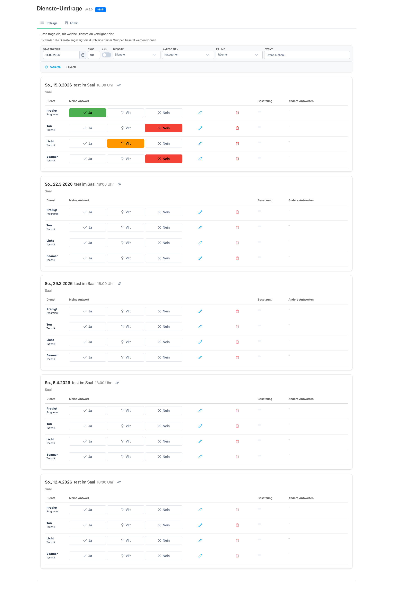
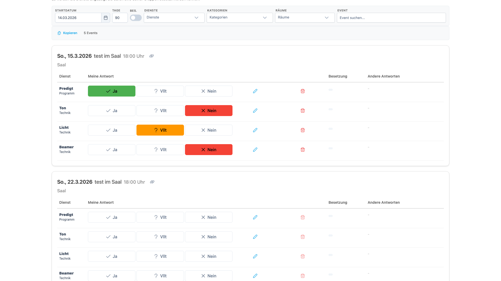
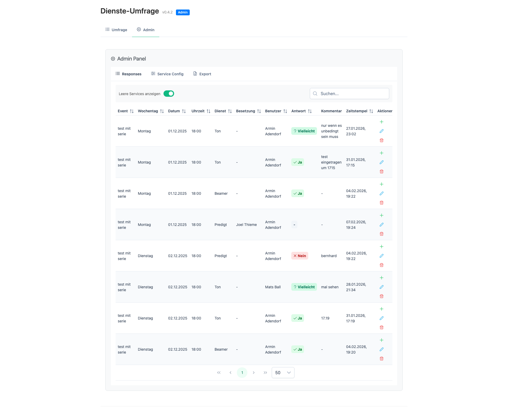
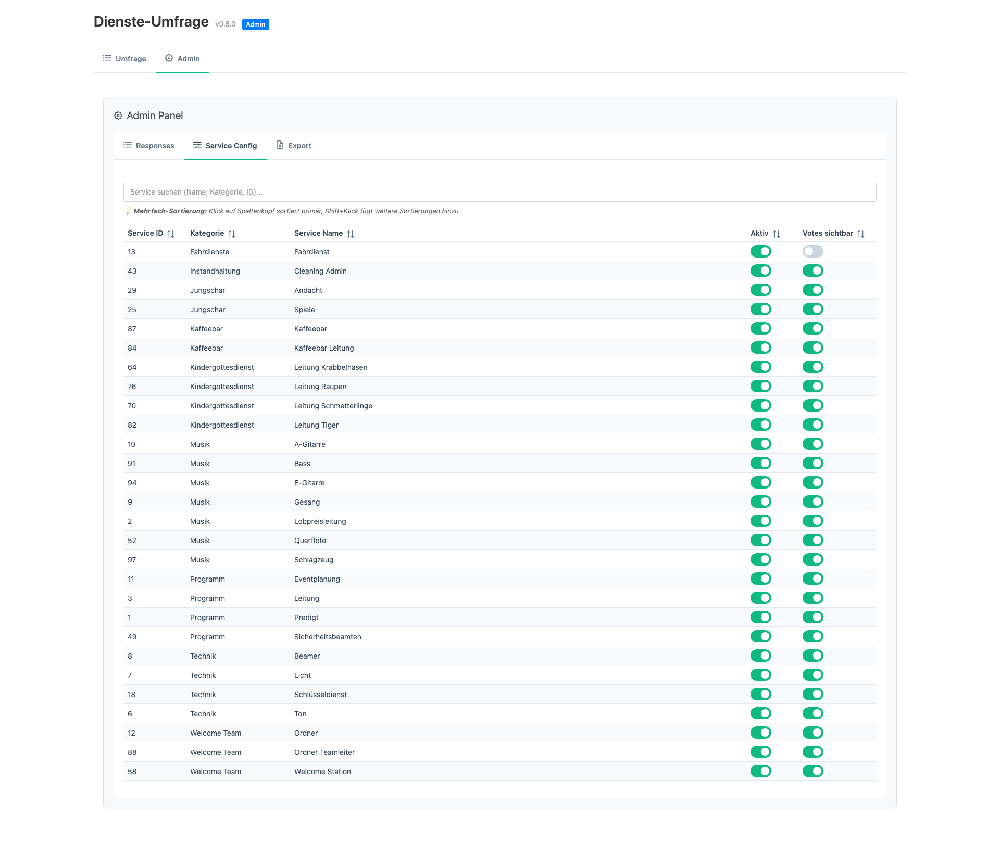
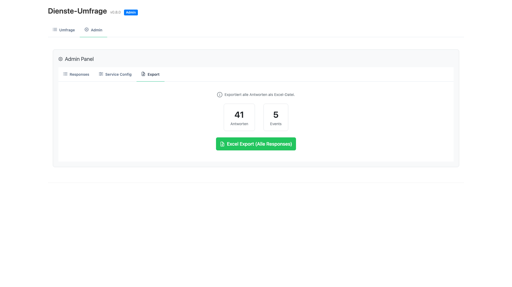

# Benutzerhandbuch: Dienst-Umfrage Extension

Diese Dokumentation richtet sich an **Administrator**, **Mitarbeiter** und **Planer**. Jeder Bereich beschreibt die relevanten Funktionen für die jeweilige Rolle.

---

## 📋 Inhaltsverzeichnis

1. [Erste Schritte: Bedienungshilfen](#erste-schritte-bedienungshilfen)
2. [Mitarbeiter: Umfrage ausfüllen](#mitarbeiter-umfrage-ausfüllen)
3. [Planer: Auswertung & Disponierung](#planer-auswertung--disponierung)
4. [Administrator: Installation, Konfiguration & Verwaltung](#administrator-installation-konfiguration--verwaltung)
5. [FAQ & Fehlerbehebung](#faq--fehlerbehebung)

---

## Erste Schritte: Bedienungshilfen

### 💡 Tooltips (Tippys)

Alle Buttons, Eingabefelder und Tabs haben **hilfreiche Beschreibungen**, die du sehen kannst:

**Wie Tooltips funktionieren:**
1. Hovere mit der Maus über einen Button, ein Eingabefeld oder einen Tab-Header
2. Nach **0,5 Sekunden** (halbe Sekunde) erscheint ein **kleiner Hilfstext** unten
3. Der Text ist zentriert und bei Bedarf mehrzeilig
4. Wenn du die Maus wegbewegst, verschwindet der Text

**Beispiele:**
- **Buttons**: "Alle Dienste und Antworten als Excel-Datei exportieren"
- **Eingabefelder**: "Wähle das Startdatum für die Dienste aus"
- **Tabs**: "Hier kannst du die Dienste für dich eintragen"
- **Admin-Funktionen**: "Verwalte alle Antworten der Benutzer"

**Hinweis:** Die Tooltips sind für Anfänger gedacht – nutze sie gerne, um die Funktionen zu entdecken!

---

## Mitarbeiter: Umfrage ausfüllen

### Schritt-für-Schritt Anleitung

#### 1. Extension öffnen
1. In **ChurchTools** anmelden (falls nicht bereits angemeldet)
2. Navigieren zur **"Dienst-Umfrage"** Extension
3. Oder direkt über den Menu-Punkt (falls konfiguriert)

#### 2. Zeitraum einstellen (optional)
Die Extension zeigt standardmäßig die nächsten **90 Tage** an.

**Zeitraum ändern:**
- **Startdatum**: Einen anderen Startpunkt auswählen (z.B. "15. Februar 2025")
  - 💡 **Tooltip:** Hovere über das Label "Startdatum" oder das Eingabefeld, um eine Beschreibung zu sehen
- **Anzahl Tage**: Die Spannweite anpassen (z.B. "30 Tage" für 1 Monat)
  - 💡 **Tooltip:** Hovere über das Label "Anzahl Tage" oder das Eingabefeld für mehr Infos

**Filter: Unbesetzte Dienste anzeigen**
- **Toggle:** "Auch besetzte anzeigen" (standardmäßig OFF)
  - 💡 **OFF (default)** = Zeigt nur Dienste, die noch nicht besetzt sind (ideal zum schnellen Ausfüllen)
  - 💡 **ON** = Zeigt alle Dienste, auch die bereits besetzten
  - 💡 **Tooltip:** Hovere über das Toggle, um mehr zu erfahren
- Diese Einstellung wird in der URL gespeichert (Parameter: `showAssigned=true/false`)

> **Hinweis:** Nur Events mit Diensten, für die Sie zuständig sind, werden angezeigt.

**Ansicht:**


#### 3. Events und Dienste sehen
Die Umfrage zeigt:
- **Event-Datum und -Name** (z.B. "So, 2. Feb 2025 - Gottesdienst")
- **Dienste** (abhängig vom Filter-Toggle)
  - **OFF (default):** Nur unbesetzte Dienste
  - **ON:** Alle Dienste (besetzt und unbesetzt)
- **Für jeden Dienst:**
  - Ihre persönliche Antwortmöglichkeit (Ja/Vielleicht/Nein)
  - Kommentarfeld (optional)
  - **Besetzung:** Bereits gebuchte Personen aus ChurchTools (mit Status: Zugesagt/Angefordert)
  - Antworten anderer Mitarbeiter

#### 4. Verfügbarkeit angeben

**Für jeden Dienst können Sie antworten:**

| Symbol | Bedeutung |
|--------|-----------|
| **✓ Ja** | Sie können den Dienst übernehmen |
| **? Vielleicht** | Sie sind unsicher oder können nur unter Bedingungen |
| **✗ Nein** | Sie können den Dienst nicht übernehmen |

**Beispiel: Lobpreis-Leitung**
```
[✓ Ja] [? Vielleicht] [✗ Nein]
[Kommentar: Nur bis 12 Uhr_____________]
```

**Ansicht (Tabellen-Layout):**


#### 5. Kommentar hinzufügen (optional)
Unter jedem Dienst gibt es ein **Kommentarfeld**, um zusätzliche Informationen zu geben:
- "Nur bis 12 Uhr erreichbar"
- "Falls Auto repariert ist"
- "Nur mit Begleitung"

**Das Kommentar wird:**
- Automatisch nach 1 Sekunde gespeichert
- Und erneut gespeichert, wenn Sie auf "Ja/Vielleicht/Nein" klicken

#### 6. Antworten anderer sehen
**Nach Ihrem Klick sehen Sie:**
- Wer hat **"Ja"** gesagt: "Anna, Peter"
- Wer hat **"Vielleicht"** gesagt: "Lisa"
- Wer hat **"Nein"** gesagt: "Tom"
- Kommentare anderer (falls vorhanden): "Anna: Nur bis 12 Uhr"

#### 7. Änderungen speichern
- **Automatisch**: Kommentare werden 1 Sekunde nach Eingabe gespeichert
- **Explizit**: Durch Klick auf Ja/Vielleicht/Nein wird alles gespeichert
- **Status**: "✓ Gespeichert" oder "✓ Kommentar gespeichert" bestätigt das Speichern

---

### Mobil vs. Desktop

**Die Extension passt sich an Ihr Gerät an:**

**📱 Mobile (Smartphone/Tablet):**
- Schlanke Darstellung übereinander
- Buttons nebeneinander (leicht zu tippen)
- Antworten kompakt darunter

**🖥️ Desktop (Computer):**
- Tabellarische Darstellung
- Alle Infos auf einen Blick
- Breiter für mehr Platz

---

## Planer: Auswertung & Disponierung

Als Planer/Disponent haben Sie zusätzliche Admin-Funktionen.

### 1. Admin-Tab öffnen
- **Admin-Badge** im Header zeigt, dass Sie Admin sind
- Klick auf den **"Admin"** Tab (neben "Umfrage")

### 2. Admin-Oberfläche
Die Admin-Oberfläche hat **3 Unterbereiche:**

#### a) **Responses** - Alle Antworten einsehen & bearbeiten

**Was sehen Sie:**
- Tabellarische Übersicht aller Umfrageantworten
- Spalten: Event, Wochentag, Datum, Uhrzeit, Dienst, Besetzung, Benutzer, Antwort (Ja/Vielleicht/Nein), Kommentar, Eingabe-Zeit, Bearbeitet von, Bearbeitungs-Zeit

**Funktionen:**

**Leere Services anzeigen (Toggle)**
- 💡 **OFF (default)** = Zeigt nur Services mit Antworten
- 💡 **ON** = Zeigt auch Services ohne Antworten

**Suchen (Suchfeld)**
- Globale Suche über alle Felder: Event, Dienst, Benutzer, Kommentare
- Tippen Sie einen Begriff ein, um die Tabelle zu filtern
- Beispiele:
  - "Gottesdienst" → zeigt alle Antworten zum Gottesdienst
  - "Anna" → zeigt alle Antworten von Anna
  - "Lobpreis" → zeigt alle Antworten zum Dienst Lobpreis

**Sortieren**
- Klick auf Spalten-Header zum Sortieren (A-Z oder Z-A)
- Multi-Sort: Klick auf mehrere Header, um nach mehreren Kriterien zu sortieren

**Bearbeiten**
- Einzelne Antworten ändern (Antwort, Kommentar)
  - Klick auf eine Antwort öffnet ein Bearbeitungs-Dialog
  - Ändern Sie die Antwort (Ja/Vielleicht/Nein) oder den Kommentar
  - Beim Speichern wird `editedBy` auf Ihren Namen gesetzt und `editedAt` auf aktuelles Datum
  - Die ursprüngliche `Eingabe-Zeit` bleibt unverändert (für Audit-Trail)
- **Löschen**: Einzelne Antworten entfernen (z.B. bei Stornierung)
- **Exportieren**: Alle Antworten als Excel-Datei herunterladen (siehe Export-Tab)

**Ansicht:**


**Audit-Trail (Änderungsverlauf):**
- **Eingabe-Zeit**: Wann der Mitarbeiter die Antwort ursprünglich eingegeben hat
- **Bearbeitungs-Zeit**: Wann die Antwort zuletzt geändert wurde (durch Sie oder den Mitarbeiter selbst)
- **Bearbeitet von**: Wer hat die Antwort zuletzt geändert (Admin-Name oder Mitarbeiter-Name)
- Beispiel: Mitarbeiter gibt "Ja" ein (31.1. 15:30), Sie ändern später zu "Nein" → "Bearbeitet von: Planer1" (31.1. 16:00)

#### b) **Service Config** - Dienste konfigurieren

**Zweck:**
- Bestimmt, welche Dienste in der Umfrage sichtbar sind
- Steuert die Sichtbarkeit von "Votes" (Antworten anderer)

**Was sehen Sie:**
- Liste aller Services aus ChurchTools
- Spalten: Service-ID, Kategorie, Service-Name, Votes sichtbar

**Funktionen:**
- **Toggle für "Enabled"**: 
  - ☑ **An** = Service wird in der Umfrage angezeigt
  - ☐ **Aus** = Service ist deaktiviert und nicht sichtbar
- **Toggle für "Votes sichtbar"**: 
  - ☑ **An** = Mitarbeiter sehen die Antworten anderer
  - ☐ **Aus** = Mitarbeiter sehen nur die bereits gebuchten Personen
  

**Hinweis:** Diese Konfiguration wird automatisch synchronisiert mit ChurchTools Masterdata.

**Ansicht:**


#### c) **Export** - Daten herunterladen

**Statistik sehen:**
- Anzahl Antworten gesamt
- Anzahl unterschiedlicher Events
- Zeitraum der Daten

**Ansicht:**



**Excel-Export durchführen:**
1. Klick auf **"Export als Excel"**
2. Excel-Datei wird heruntergeladen
3. Dateiname: `responses_[Startdatum]_[Enddatum].xlsx`

**Excel-Inhalte:**
- Event (Name, Datum)
- Dienst
- Benutzer
- Antwort (Ja/Vielleicht/Nein)
- Kommentar
- Eingabe-Zeitstempel (ursprüngliche Erfassung)
- Bearbeitet von (Admin-Name oder Mitarbeiter-Name, falls geändert)
- Bearbeitungs-Zeitstempel (letzte Änderung, falls vorhanden)

**Verwendung:**
- Disposition außerhalb der Extension planen
- Berichte für Leitung erstellen
- Verfügbarkeitsanalyse durchführen

---

### 3. Disponierung: Best Practice

**Empfohlener Ablauf:**

1. **Responses anschauen** (Admin → Responses)
   - Filter auf ein Event setzen
   - Sehen, wer "Ja", "Vielleicht" oder "Nein" gesagt hat

2. **Kommentare berücksichtigen**
   - "Nur bis 12h" → zeitlich begrenzte Zusage
   - "Falls Auto läuft" → bedingte Zusage

3. **Bereits gebuchte sehen**
   - In der Mitarbeiter-Umfrage wird angezeigt, wer bereits fest gebucht ist
   - Nutzen Sie das für die Disponierung

4. **Excel exportieren** (Admin → Export)
   - Für tiefere Analyse und Berichterstellung

5. **Rückmeldung an Mitarbeiter**
   - Z.B. per Mail: "Du bist für Lobpreis-Leitung am 2.2. eingeplant"

---

## Administrator: Installation, Konfiguration & Verwaltung

### 1. Extension installieren

#### Schritt 1: Package beziehen
- Die Extension wird als Package-Datei bereitgestellt (Dateiname: `bwl-poll-event-services-x.x.x.zip`)
- Das Package sollte vom Entwickler oder der IT bereitgestellt werden

#### Schritt 2: In ChurchTools hochladen
1. **ChurchTools Admin öffnen** → "System Settings" → "Integrations"
2. Navigieren zu **"Custom Modules"** (oder "Extensions")
3. Klick auf **"Upload Extension"** oder **"+ Add Extension"**
4. Die heruntergeladene ZIP-Datei auswählen und hochladen
5. Nach erfolgreichem Upload wird die Extension in der Liste angezeigt

#### Schritt 3: Extension aktivieren
1. Die neu installierte Extension **"bwl-poll-event-services"** in der Liste suchen
2. Klick auf **"Activate"** oder **"Enable"**
3. Die Extension wird nun allen Benutzern verfügbar gemacht

### 2. Berechtigungen konfigurieren

#### Admin-Berechtigung erteilen
1. **ChurchTools Admin** → "Permissions" → "Roles"
2. Eine Rolle wählen, die Admin-Zugriff haben soll
3. Suchen nach: **"bwl-poll-event-services"** → **"admin-config"** (Lesezugriff)
4. Die Berechtigung **aktivieren** (☑ Read access)
5. Speichern

> **Tipp:** Normalerweise erhalten Planer/Disponenten diese Berechtigung.

#### Benutzer mit Gruppenzugehörigkeit
- Alle Benutzer sehen automatisch nur die Dienste ihrer Gruppen
- Keine separaten Berechtigungen nötig
- Die Berechtigung basiert auf der Gruppenzugehörigkeit in ChurchTools

### 3. Berechtigungscheck durchführen (optional)

Nach der Installation können Sie testen:
1. Als normaler Benutzer anmelden
2. Die Extension öffnen
3. Es sollten nur Events mit Diensten Ihrer Gruppen angezeigt werden

---

## FAQ & Fehlerbehebung

### Häufig gestellte Fragen

#### **F: Ich sehe keine Events in der Umfrage.**
**A:** 
- Überprüfen Sie, ob Sie in den richtigen Gruppen sind
- Fragen Sie Ihren Administrator, welche Gruppen für welche Dienste zuständig sind
- Versuchen Sie, den Zeitraum zu ändern (z.B. weiter in die Zukunft)

#### **F: Meine Antwort wird nicht gespeichert.**
**A:**
- Überprüfen Sie die Internet-Verbindung
- Schauen Sie auf die Statusmeldung (grünes ✓ = gespeichert)
- Versuchen Sie, die Seite neu zu laden (F5)
- Bei persistenten Problemen: Kontaktieren Sie IT-Support

#### **F: Ich sehe die Admin-Funktionen nicht.**
**A:**
- Sie müssen Admin-Berechtigungen haben (siehe [Administrator: Installation, Konfiguration & Verwaltung](#administrator-installation-konfiguration--verwaltung) oben)
- Fragen Sie Ihren Administrator, die Berechtigung zu erteilen
- Nach Berechtigung-Erteilung: Seite neu laden

#### **F: Kann ich meine Antwort nachträglich ändern?**
**A:**
- **Ja!** Sie können jederzeit auf der Umfrage-Seite Ihre Antwort ändern
- Einfach eine andere Antwort (Ja/Vielleicht/Nein) klicken
- Die neue Antwort wird sofort gespeichert

#### **F: Sehe ich die Kommentare anderer?**
**A:**
- **Ja**, wenn:
  - Der Service in der Admin-Config so konfiguriert ist
  - Der andere Mitarbeiter einen Kommentar hinzugefügt hat
- Der Kommentar wird neben der Antwort angezeigt

#### **F: Wie lange werden meine Daten gespeichert?**
**A:**
- Alle Antworten werden unbegrenzt im ChurchTools Key-Value-Store gespeichert
- Sie können alte Antworten im Admin-Panel löschen, falls nötig
- Ein Backup ist über ChurchTools-Backups geschützt

#### **F: Kann der Admin Antworten bearbeiten?**
**A:**
- **Ja!** Der Admin kann im "Responses" Tab einzelne Antworten bearbeiten
- Dies ist z.B. nötig, wenn Sie eine Antwort korrigieren müssen
- Beim Bearbeiten wird dokumentiert:
  - **Wer** hat die Antwort geändert (Ihr Name in `editedBy`)
  - **Wann** wurde sie geändert (`editedAt` Zeitstempel)
  - **Wann** wurde sie ursprünglich eingegeben (`timestamp` bleibt unverändert)
- Dies ermöglicht volle Nachverfolgbarkeit (Audit-Trail)

#### **F: Kann der Admin Antworten löschen?**
**A:**
- **Ja.** Der Admin kann im "Responses" Tab einzelne Antworten löschen
- Dies ist z.B. nötig, wenn sich ein Mitarbeiter abmeldet oder die Antwort obsolet ist
- Gelöschte Antworten können nicht wiederhergestellt werden → mit Bedacht nutzen!
- Tipp: Statt Löschen kann man auch bearbeiten und auf "keine Angabe" setzen

#### **F: Wo finde ich die Excel-Datei nach dem Export?**
**A:**
- Die Datei wird in Ihren "Downloads" Ordner heruntergeladen
- Dateiname: `responses_[Datum]_[Datum].xlsx`
- Sie können sie mit Excel oder Google Sheets öffnen

#### **F: Was bedeutet die "Besetzung" Spalte?**
**A:**
- Die Besetzungs-Spalte zeigt, wer bereits fest für einen Dienst gebucht ist (aus ChurchTools)
- **Grüner Status (Zugesagt)**: Die Person hat bereits zugesagt und ist verbindlich gebucht
- **Orange Status (Angefordert)**: Die Anfrage ist noch ausstehend, wartet auf Antwort
- Wenn Sie den Toggle "Auch besetzte anzeigen" **OFF** haben (default), werden bereits besetzte Dienste verborgen
- Wenn Sie den Toggle **ON** schalten, sehen Sie alle Dienste - auch die schon besetzten

#### **F: Wie teile ich die Umfrage mit einem bestimmten Zeitraum mit jemandem?**
**A:**
- Nutzen Sie den **"URL kopieren"** Button (Kopier-Symbol)
- Der Button kopiert die URL mit all Ihren aktuellen Einstellungen in die Zwischenablage:
  - Startdatum
  - Anzahl der Tage
  - Toggle-Status ("Auch besetzte anzeigen")
- Teilen Sie die kopierte URL mit Ihrem Kollegen
- Dieser öffnet die URL und sieht genau den gleichen Zeitraum und Filter

---

### Technische Probleme

#### **Problem: Browser zeigt "CORS Error"**
**Symptom:** Fehler wie "CORS policy blocked" oder "Access denied"

**Lösung:**
- Dies ist ein Server-Setup-Fehler
- Kontaktieren Sie Ihren IT-Administrator
- Administrator-Info: CORS muss in ChurchTools für die Extension URL konfiguriert sein

#### **Problem: Login funktioniert nicht**
**Symptom:** "Invalid credentials" oder "401 Unauthorized"

**Lösung:**
- Überprüfen Sie, dass Sie mit den richtigen ChurchTools-Zugangsdaten angemeldet sind
- Versuchen Sie, sich ab- und wieder anzumelden
- Bei persistiertem Problem: ChurchTools-Session ist abgelaufen → neu anmelden

#### **Problem: Seite lädt nicht (Weiße Seite)**
**Symptom:** Extension öffnet, zeigt nur Weiß

**Lösung:**
- Browser-Cache löschen (Strg+F5 oder Cmd+Shift+R)
- Versuchen Sie einen anderen Browser
- Überprüfen Sie die Internetverbindung
- Kontaktieren Sie Administrator, falls Problem persisiert

### Für Mitarbeiter:
- Füllen Sie die Umfrage zeitnah aus (je eher, desto besser kann Ihr Planer disponieren)
- Nutzen Sie die **Tooltips**, um die Funktionen schneller zu verstehen
- Setzen Sie einen Kommentar, wenn Sie zeitlich begrenzt verfügbar sind
- Ändern Sie Ihre Antwort, wenn sich etwas ändert (z.B. Krankheit)

### Für Planer:
- Exportieren Sie regelmäßig die Responses zur Archivierung
- Nutzen Sie Filter im Responses-Tab für schnellere Auswertung
- Überprüfen Sie auch die Kommentare - sie enthalten wichtige Info!
- Löschen Sie alte Responses regelmäßig (Keep-Policy festlegen)

### Für Administrator:
- Überprüfen Sie nach der Installation die Berechtigungen
- Teilen Sie das Benutzerhandbuch mit Benutzern
- Sichern Sie regelmäßig Backups (Standard ChurchTools-Backup reicht)
- Kontrollieren Sie die Datenmenge (sehr große Datenmengen können Speicher beanspruchen)

---

## 📞 Weitere Ressourcen

- **ChurchTools Dokumentation**: https://www.church.tools/help
- **Dieses Handbuch**: `docs/USERMANUAL.md`
- **Technische Anforderungen**: `docs/Requirements.md`

---

**Version 0.5.0** | Letzte Aktualisierung: Feb 2026
- 🐛 Kritischer Bugfix: Dienst-ID Zuordnung korrigiert (Antworten werden nun korrekt dem richtigen Dienst zugeordnet)
- 🔒 Sicherheit: Excel-Export schützt nun vor Formel-Injection in Kommentaren und Benutzernamen
- 🔒 Sicherheit: Admin-Funktionen prüfen nun Berechtigungen serverseitig
- ⚡ Performance: Parallele Datenanfragen werden bei schnellen Eingaben nicht mehr überschrieben
- ✨ Verbesserte Rückmeldungen: Toast-Benachrichtigungen bei URL-Kopieren, Admin-Speichern und -Löschen
- 🏗️ Toggle umbenannt: "hideAssigned" → "showAssigned" (URL-Parameter: `showAssigned=true`)
- 🏗️ Zentralisiertes Debug-Logging über `?debug` URL-Parameter
- 🏗️ Datum-Formatierung konsolidiert in gemeinsames Modul

**Version 0.4.2** | Feb 2026
- ✨ Neue Feature: Filter-Toggle "Auch besetzte anzeigen" zum Fokus auf unbesetzte Dienste
- 🔗 URL-Parameter für Zeitraum und Filter-Einstellungen (teilbar mit Kollegen)
- 🎨 Text-Wrapping in der "Besetzung"-Spalte für lange Namen
- ✨ Verbesserte UX mit floating-vue
